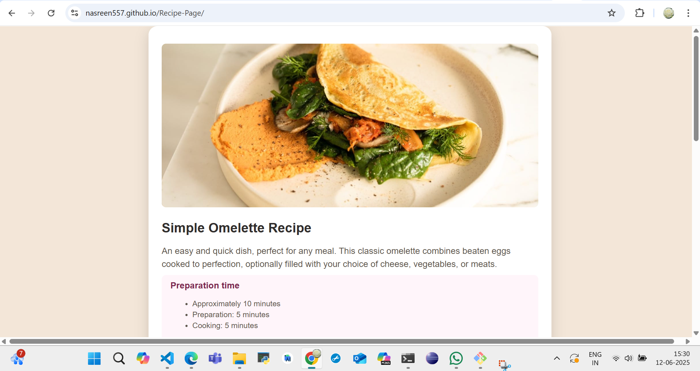
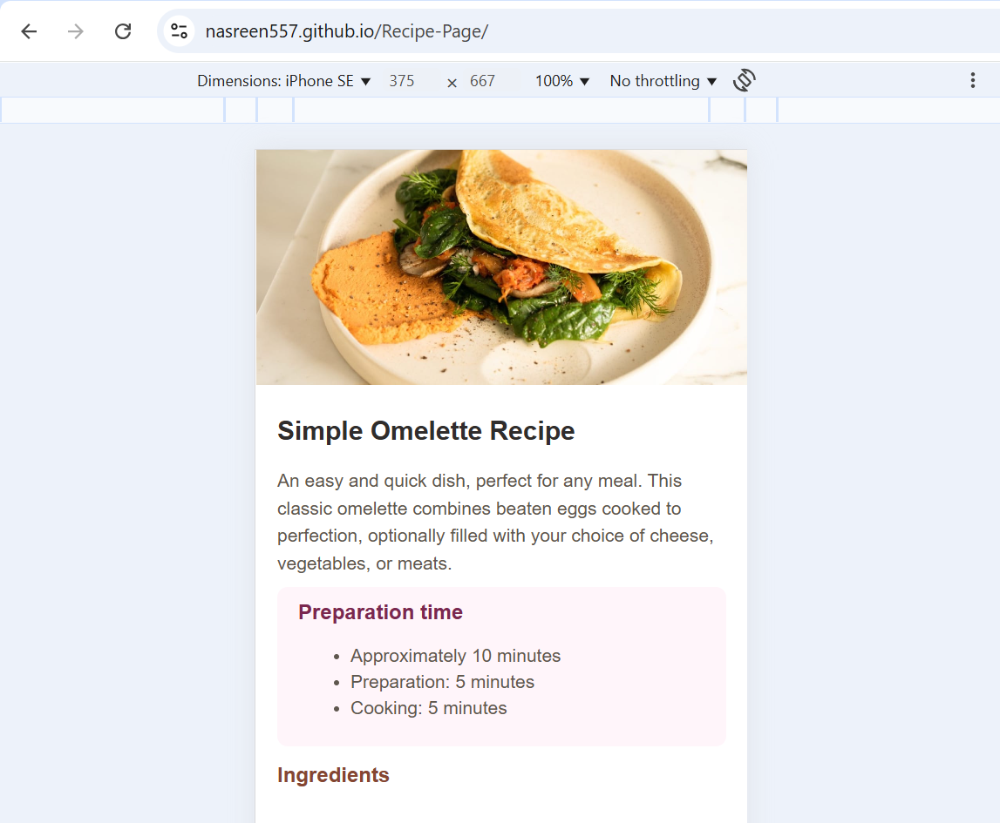

# Recipe page

## Welcome to Recipe Page! 👋

# 🍳 Recipe Page Challenge

This is a solution to the [Frontend Mentor Recipe Page Challenge](https://www.frontendmentor.io). Built using HTML and CSS.

## 💻 Live Preview

[View Live Site](https://nasreen557.github.io/Recipe-Page/)

## 🚀 Built With

- HTML5
- CSS3 (Flexbox/Grid)
- Responsive Design
- Mobile-first Workflow

## 📸 Screenshots

## 💡 What I Learned

- CSS spacing and typography from a static design.
- Using semantic HTML structure.
- Responsive techniques for layout switching.

## 🔗 Links

- Solution URL: [GitHub](https://github.com/Nasreen557/Recipe-Page)
- Live Site URL: [Live](https://nasreen557.github.io/Recipe-Page/)

## 🙋‍♀️ Author

- GitHub: [@YOUR_USERNAME](https://github.com/Nasreen557)
- Frontend Mentor: [@yourhandle](https://www.frontendmentor.io/profile/Nasreen557)
